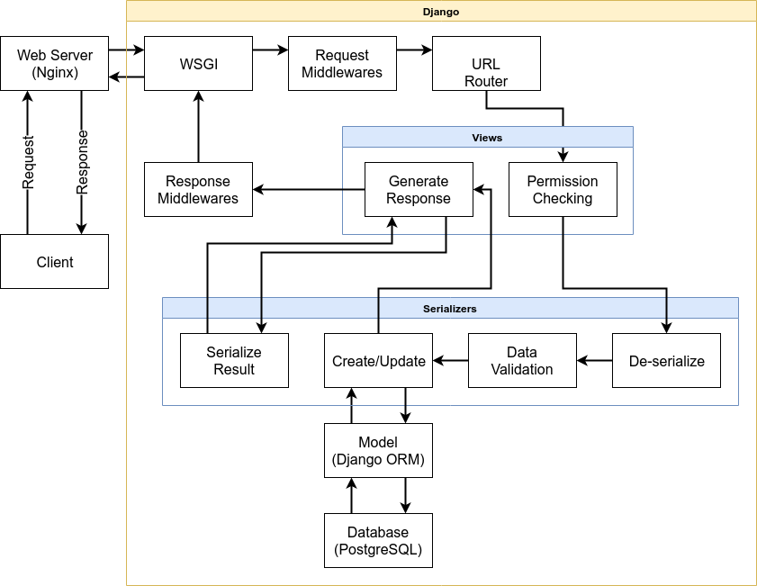

[TOC]

# File Structure

```
srpms/
├── accounts                 # Account app
│   ├── migrations/              # Database migration for this app
│   ├── __init__.py
│   ├── admin.py                 # Django admin page configuration
│   ├── apps.py                  # App config and initialization
│   ├── authentication.py        # ANU LDAP Authentication backend
│   ├── models.py                # Database schema for this app
│   ├── serializers.py           # Data serializers for encode/decode JSON for API
│   ├── tests.py                 # Tests for this app
│   ├── urls.py                  # How this app locate itself in url
│   └── views.py                 # Views handle requests and generate response
├── research_mgt             # Research management system app
│   ├── migrations/              # Database migration for this app
│   ├── static/                  # Static resources for generate contract PDF
│   │   └── research_mgt/
│   ├── templates/               # HTML templates for generate contract PDF
│   │   └── research_mgt/
│   ├── tests/                   # Tests for this app
│   ├── __init__.py
│   ├── admin.py                 # Django admin page configuration
│   ├── apps.py                  # App config and initialization
│   ├── filters.py               # Filters that enable url query, e.g. '?key=value'
│   ├── mixins.py                # Custom mixins to support nested url
│   ├── models.py                # Database schema for this app
│   ├── permissions.py           # Permission control for request sender
│   ├── print.py                 # Print contract to PDF
│   ├── serializers.py           # Data serializers for encode/decode JSON for API
│   ├── serializer_utils.py      # Custom serializer field
│   ├── signals.py               # Define signals, and send notifications on signal
│   ├── urls.py                  # How this app locate itself in url
│   └── views.py                 # Views handle requests and generate response
├── srpms                    # System configuration
│   ├── __init__.py
│   ├── settings.py          # System settings
│   ├── urls.py              # Root url
│   ├── utils.py             # Custom exception handler for server error
│   └── wsgi.py
├── Dockerfile               # Dockerfile for building the django image
├── manage.py
└── start.sh                 # Start up script (only for docker use)
```

# Django project overview

This section would only give simple overview of a typical Django project, for more details please read [Django's nice documentation](https://docs.djangoproject.com/en/2.2/).

A overview of a typical Django project directory structure

```
project_name/           # Project root
├── app_01/
├── app_02/
├── project_name/      # Project configurations
│   ├── settings.py        # Overall project settings
│   ├── urls.py            # URLs configuration of the project
│   └── wsgi.py
└── manage.py
```

- `wsgi.py` and `manage.py` are generated by Django when create the project with `django-admin startproject <project_name>`
  - `django-admin` is a command available from Django's python package
- `manage.py` provides the Django's management interface, issue `python manage.py help` for detail information
  - It includes support for database migration, superuser creation, django app skeleton generation, and more

## Apps in Django Project

A Django project consists of one or more app, each app represents a distinct set of functionalities you want to deliver to user. The skeleton of an app can be generated through `python manage.py startapp <app_name>`

In this project, our main goal is to provide the research contract management system, and all functionalities regarding this goal would provided through the `research_mgt` app.

We also have a separate app `accounts` providing user management and authentication functionalities. This set of functionalities is separated from `research_mgt` for the consideration that user management and authentication is not app specific, and might be used for other apps (in the case that we have other apps in the future).

## General Structure of a Django App with REST framework

The typical structure of a Django app is as follow:

```
app-name/
├── migrations/
├── __init__.py
├── admin.py
├── apps.py
├── models.py
├── serializers.py
├── tests.py
├── urls.py
└── views.py
```

- `migrations/` correspond to database operations through Django ORM
  - These operations are normally auto generated through Django's `makemigrations` management command
  - Creation of initial database data should also be placed here, e.g. create courses and assessment templates when the database first initialize
- `admin.py` includes support for Django's admin site for this app, note that this project currently does not utilize this. [Read more about Django admin site](https://docs.djangoproject.com/en/2.2/ref/contrib/admin/)
- `apps.py` is the entry when Django try to load this app, normally don't modify
  - [Signals](https://docs.djangoproject.com/en/2.2/topics/signals/) (if any) are recommended to be initialized here
- `models.py` defines the database model that would be used inside this app
- `serializers.py` defines how data from database models is being converted to JSON, and how JSON data would write to database models
  - The JSON data structure and database model need not to be the same, one JSON data serializer can write to multiple database model, and one database model can correspond to multiple serializer.
  - Request sender unrelated business logic are defined here.
- `tests.py` includes test for this app
  - Any function define in this file that follows `test_*` pattern would be automatically included when issue `python manage.py test`
- `urls.py` defines the URL layout of this app
- `views.py` defines how to response request for each URL. 

You would also see the following addition file structure more common on Django project without REST framework. They are less common for projects using REST framework as Django is only being used for sending/receiving JSON data, and don't do any server side page rendering.

```
app-name/
├── templates/
│   └── app-name/
└── static/
    └── app-name/
```

- `templates/app-name/` includes HTML templates and CSS that would be used to generate pages for this app
- `static/app-name/` includes resources (e.g. images) that would be used to render the HTML page

# Request Life Cycle in Django REST Framework



# Authentication

The project is using both Django model back-end (`django.contrib.auth.backends.ModelBackend`) and [django-auth-ldap](https://github.com/django-auth-ldap/django-auth-ldap) package to offer authentication service. Of which:

- Django model back-end is our own user database, for the purpose of authenticating users don't exist in ANU (but exist in our system).
- django-auth-ldap is configured to connected to ANU LDAP server, so that users can use their ANU username and password to login to this system
  - User information stored in ANU LDAP server would be poped/updated to our own user database on every login attempt.

For every login request, it'll first try to login using ANU LDAP service, and try our own user database if  the previous one failed.

- Please note that information poped from ANU LDAP service only include user information (e.g. name, id, affiliations), and does not include password.
- User login using their ANU account would not have their password stored in our user database, but a user instance that cannot be used for login, with unusable password generated by Django.

# Models, serializers and their validation

- This project implemented a total of three 3 levels for data validation
  1. Model level. Regardless of the requester's privilege and all data instance from this model must comply
  2. Instance level. Might vary depending on user's privilege, only apply to instance that have certain property
  3. Field level. Regardless of the requester's privilege, e.g. integer field should not have string value
- Validation for business logic and database model should be separated clearly, business logic related validation should be done by serializers, and database model should not touch any business logic that are instance related.
  - [Differences between ModelSerializer validation and ModelForm.](https://www.django-rest-framework.org/community/3.0-announcement/#differences-between-modelserializer-validation-and-modelform)
  - [Django models, encapsulation and data integrity](https://www.dabapps.com/blog/django-models-and-encapsulation/)
- Database model's constraint only apply at model level, e.g. contract's assessment must sum to 100
  - Instance level constraint (e.g. this type of contract should belong to a course instance) should be put in higher level.

# Permissions

This project implemented a total of three 3 levels of permissions

1. Field level. Decide whether the user have the privilege to edit a field of a instance
2. Instance (Object) level. Decide whether the user can modify/delete a instance, i.e. PUT, PATCH, or DELETE.
3. View level. Decide whether a user can GET, POST, to a certain URL

## List of Groups & Permissions

- Permissions
  - `can_convene`, users with this permission can become course convener
  - `can_supervise`, users with this permission can become formal supervisor
  - `is_mgt_superuser`, users with this permission can almost do anything, even edit a finalized contract
- Groups:
  - `approved_supervisors`, users in this group has permission `can_supervise`
  - `course_convener`, users in this group has permission `can_convene`
  - `mgt_superusers`, users in this group has permission `is_mgt_superuser`
