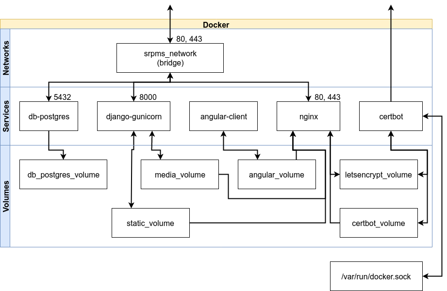
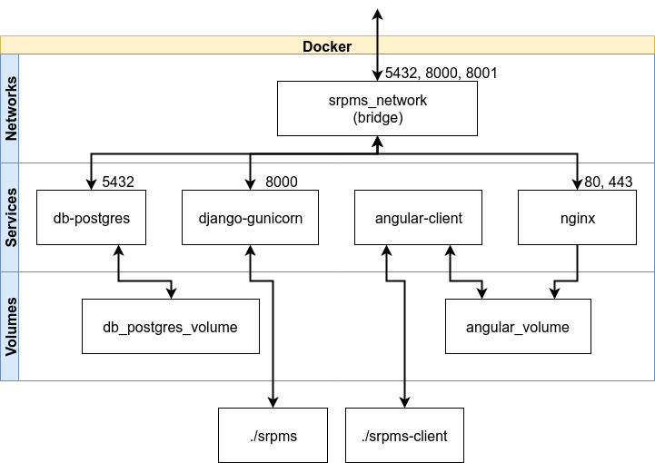
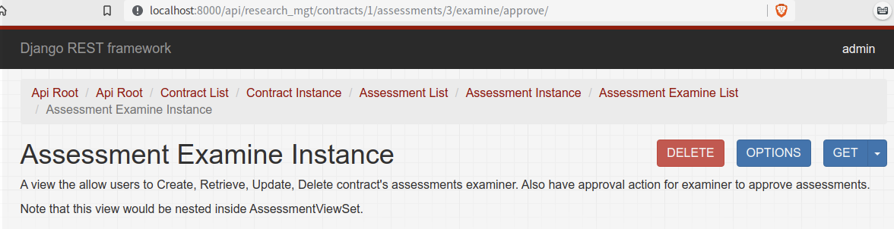
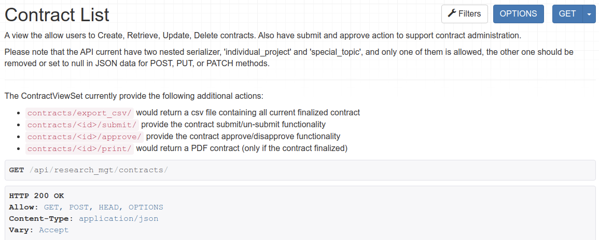

[TOC]

# SSL Certificate

**NOTE: This section should be read before attempting any deployment**

The project have below configurations for different deployment methods

- <u>Production deployment</u>: a free and valid SSL certificate for `srpms.cecs.anu.edu.au` would be issue by [Let's Encrypt](https://letsencrypt.org/), the certificate request/update and configuration process is autonomous.
- <u>Development deployment</u>: a invalid SSL certificate for domain `localhost` would be generated by OpenSSL command line tool, the configuration process is autonomous
- <u>Testing</u>: a invalid SSL certificate for domain `localhost` would be generated by OpenSSL command line tool, the configuration process is autonomous

## Special note for Let's Encrypt certificate

- The certificate Let's Encrypt can issue **per Registered Domain** is **50 per week**
  - For example, `api.srpms.cecs.anu.edu.au` and `srpms.cecs.anu.edu.au` would be in the same registered domain. 
  - Though we only have one domain currently, the rate limit is still worth mentioning.
- The renewal of an existing certificate is **5 times per week**
  - For example, once `srpms.cecs.anu.edu.au` obtain a certificate, it can only be renew 5 times each week
  - Each renewal is valid for **90 days**

For more information, refer to [Let's Encrypt's rate limit](https://letsencrypt.org/docs/rate-limits/)

# Deploy - Production

**NOTE: Make sure the production machine have a public IP**

**NOTE: Production deployment does not support server that is outside ANU network**

## Architecture overview

**NOTE**: For the below diagram, the swimlane `Services` can be regarded as `Containers`. A service defined in docker compose can have multiple container of the same docker image, however in our case each service is only configured to have one container.



- In production deployment, file system mapping (i.e. bind mount) between the physical machine and docker container should be avoided, as the deployment might be executed within other docker container. For more details, refer to [manage data in docker](https://docs.docker.com/storage/).
- The `/var/run/docker.sock` is a unix socket that can be used to access docker in the host machine, the `certbot` service has this mapping so that it can reload `nginx` service when SSL certificate update.
- The `srpms_network` expose port `80` and `443` to the outside network, both ports are mapped to the same ports on `nginx` service
- The `db-postgres` service expose port `5432` internally, so that other container inside `srpms_network` can access the database
- The `django-gunicorn` service expose port `8000` internally, and `nginx` would forward API request there
- The `certbot` container is not part of the `srpms_network` by design, instead, it connect directly using the host machine's network.
  - **NOTE**: The `certbot` service exist solely because the website is currently using free SSL certificate provided by [Let's Encrypt](https://letsencrypt.org/). Though ideally it should use SSL certificate issue by ANU.
- The `angular-client` service does not have any network connectivity by design, the service would exist automatically after it finished compiling the angular source code.
  - The compile result would be copied to the data volume shared between `nginx` and `angular-client`, i.e. the compile result is hosted by `nginx`.

## CECS VM Clean up

```bash
# For srpms.cecs.anu.edu.au only
# Since we are using docker, we'll disable un-necessary services
sudo systemctl disable nginx.service
sudo systemctl stop nginx.service
sudo systemctl disable postgresql.service
sudo systemctl stop postgresql.service
sudo pkill -U tomcat8
```

Note that the provided VM currently has many unrelated packages installed, we're NOT going to clean them all, but just free up ports as much as possible.

## Install docker

```bash
sudo apt-get update

# Install packages to allow apt to use a repository over HTTPS
sudo apt-get install \
    apt-transport-https \
    ca-certificates \
    curl \
    gnupg2 \
    software-properties-common

# Add Docker’s official GPG key
curl -fsSL https://download.docker.com/linux/debian/gpg | sudo apt-key add -

# Setup the stable source for docker binary
sudo add-apt-repository \
   "deb [arch=amd64] https://download.docker.com/linux/debian \
   $(lsb_release -cs) \
   stable"

# Update apt and install docker
sudo apt-get update
sudo apt-get install docker-ce docker-ce-cli containerd.io

# At this stage, you might want to put your linux user inside the 'docker' group, otherwise sudo privilege is required for using docker command

# Enter swarm mode since we need to use docker secrets
docker swarm init
```

## Configure iptable

**Please refer to [Server iptables rule](#server-iptables-rule) section at the bottom of this file for iptable rules**

```bash
sudo apt-get install iptables-persistent

# Put the iptables rule given in following section under corresponding folder
#mv iptable-rules /etc/iptables/rules.v4

# Reload docker's its iptables rules
sudo systemctl restart docker.service

# Reload the configuration
sudo systemctl restart netfilter-persistent
```

## Configure repository for group access

Sometimes CI runner cannot take care of all the situations, and you need to do things manually. This section is for this purpose.

```bash
# Create folder at root for group access
sudo mkdir /srpms
sudo addgroup srpms
sudo chown root:srpms /srpms
sudo chmod g+w /srpms

# Download source code
git clone https://gitlab.cecs.anu.edu.au/u6513788/comp8755-srpms.git .
# Configure git for group access
git config core.sharedRepository group
# Change file ownership and permission to allow group access
chgrp -R srpms .
chmod -R g+w .
# Git pack files should be immutable
chmod g-w objects/pack/*
# Configure new file to inherit directory's group id
find -type d -exec chmod g+s {} +
```

## Secrets

Docker secrets provide a convenient way for providing sensitive information (e.g. username, password of the database). You don't want to include these information inside the git repository. 

```bash
# Create directory for storing secrets, and give group access
sudo mkdir /srpms-secrets
sudo chown root:srpms /srpms-secrets
sudo chmod 750 /srpms-secrets
sudo chmod g+s /srpms-secrets

# Create secrets
# NOTE: DO NOT USE "echo" AS IT WOULD SUFFIX NEW LINE CHARACTER

# The below information would be used to initializa postgres database (if the database does not exist), and would be used by Django to access the database

# Database name
sudo printf '<secret content>' > /srpms-secrets/postgres-db.txt
# Database username
sudo printf '<secret content>' > /srpms-secrets/postgres-user.txt
# Database password
sudo printf '<secret content>' > /srpms-secrets/postgres-passwd.txt

# "--" would prevent "--" raise error when its at the start of the content string
sudo printf -- '<secret content>' > /srpms-secrets/postgres-init-args.txt

# Django secret key is used for various purpose, for example, hashing user's password so that they won't store in plain text, exposure of this secret key would result all user's password being compromised.
sudo printf '<secret content>' > /srpms-secrets/django_secret_key.txt
```

**NOTE: secrets still work even if you configure this on the local machine, and use docker inside a container through socket passing, and does not require any special configuration**

## CI/CD pipeline setup

**NOTE: You can do things in this section on a different machine (in the case that the production server is not suitable for running test for some reason)**

The project use GitLab's shell executor with docker runner for this purpose. Below is the steps to configure necessary files and parameters.

```bash
# cd to the runner image dir
cd gitlab-ci

# Register first
docker-compose run runner register

# Start the runner
docker-compose up -d

# Create directory for storing secrets, and give group access
sudo mkdir /srpms-secrets-test
sudo chown root:docker /srpms-secrets-test
sudo chmod 750 /srpms-secrets-test
sudo chmod g+s /srpms-secrets-test

# Set up secrets for testing (on your host machines)
sudo printf '<secret content>' > /srpms-secrets-test/postgres-db.txt
sudo printf '<secret content>' > /srpms-secrets-test/postgres-user.txt
sudo printf '<secret content>' > /srpms-secrets-test/postgres-passwd.txt
sudo printf -- '<secret content>' > /srpms-secrets-test/postgres-init-args.txt
sudo printf '<secret content>' > /srpms-secrets-test/django_secret_key.txt

# For testing LDAP connection and user property mapping, you'll need to set up username and password on you test machine, not setting these two variables would cause test error.
sudo printf '<secret content>' > /srpms-secrets-test/django_test_ldap_username.txt
sudo printf '<secret content>' > /srpms-secrets-test/django_test_ldap_password.txt
```

About `django_test_ldap_username` and `django_test_ldap_password`:

- Must be a valid ANU username and password
- Every time user login using ANU credential, Django would pop user information from ANU LDAP, this test is to make sure that user info popping is working correctly.

**NOTE**: If your test machine is outside ANU network, you'll need to set up a ssh tunnel, refer to [Access ANU LDAP outside campus](#Access-ANU-LDAP-outside-campus) for instructions.

## Manually start the service

This section covers how to start the back-end from command line through docker. For production deployment, it currently only support docker, in order to guarantee the consistency of its behavior. Refer to [Deploy - development](#deploy---development) section if you want to run without docker.

```bash
# For simplicity, we wrap the docker command to a shell variable
COMPOSE_DEPLOY='docker-compose -f docker-compose.prod.base.yml -f docker-compose.prod.deploy.yml'

# Start up
$COMPOSE_DEPLOY up -d

# Stop
$COMPOSE_DEPLOY stop

# Check logs, append '-f' for following
$COMPOSE_DEPLOY logs

# Shutdown and remove containers
$COMPOSE_DEPLOY down
```

## Cleaning

**CAUTION: removing the `letsencrypt_volume` would effectively remove the certificate issued by Let's Encrypt, and Let's Encrypt has a rate limit for obtaining new certificates** 

`$COMPOSE_DEPLOY down` given by the previous section would not remove docker images, data volumes, and networks

- That is, the data of the database, issued certificates, static files, etc. would still exist, only the docker container (i.e. services) would be removed
- The `srpms_network` also continue to exist.
- The docker image of corresponding service would exist as well. Recall that containers are  instantiated docker image.

To see the list of docker data volumes: `docker volume ls`

To see the list of docker networks: `docker-network ls`

To clean all data volume, network, images, and containers: `$COMPOSE_DEPLOY down --rmi 'local' -v --remove-orphans`

# Deploy - Development

**NOTE: development deployment is only meant to be accessed through localhost** 

## Through docker



- The `srpms_network` expose port `5432`, `8000` and `8001` to the outside network, of which `5432` map to `5432` port of `db-postgres` service, `8000` map to `80` port of `nginx` service,  `8001` map to `443` port of `nginx` service
- The `django-gunicorn` service expose port `8000` internally, and `nginx` would forward API request there
- `./srpms` refers to the folder (that contains Django source code) locates on your physical machine, in development mode, Django would automatically reload when it detect changes on any file within this directory, so that your latest modification can be applied instantly.
- `./srpms-client` refers to the folder (that contains Angular source code) locates on your physical machine, in development mode, Angular would automatically compile the new source code when it detect changes on any file within this directory, so that your latest modification can be applied instantly.
  - However, you still need to refresh the page, or possibly reload all resources (<kbd>Ctrl</kbd> + <kbd>F5</kbd> for chrome based browsers) in order to see new changes
- `angular-client` runs `ng build --watch` to produce front-end code, the compile result is hosted by `nginx` through a shared data volume

- `django-gunicorn` runs `gunicorn --reload --bind :8000` to serve back-end content (including back-end static and media files)

**Please make sure you are under the project root directory when using following commands**

```bash
# If your machine is inside campus, use ldap://ldap.anu.edu.au, otherwise refer to the 'Access ANU LDAP outside campus' section
export LDAP_ADDR='<ANU_LDAP_ADDR>'

# Build images if this is your first run
docker-compose -f docker-compose.dev.yml build

# Start, will run in background
docker-compose -f docker-compose.dev.yml up -d

# To apply changes of Dockerfile and compose file to running containers, use the following command (remove --build if you did not change any Dockerfile)
docker-compose -f docker-compose.dev.yml up -d --build

# Stop containers
docker-compose -f docker-compose.dev.yml stop

# This command will remove container, network, and volumes, which means the database would be removed as well
docker-compose -f docker-compose.dev.yml down --rmi 'local' -v --remove-orphans
```

## On local machine

Having everything running inside docker can sometimes make debug very painful, as you won't have IDE debugging tools support, e.g. breakpoint. As such we sometimes need to run code outside container.

- To run Django on local machine:

  ```bash
  export DEBUG=True
  
  # NOTE: Activate your conda environment first
  
  # Run the database
  docker-compose -f docker-compose.dev.yml up -d db-postgres
  
  cd srpms
  python manage.py runserver
  ```

  - Please note that HTTPS settings are defined in a way that would not be applied if you run Django in local machine.
  - Please note that `angular-client` and `nginx` is depend on `django-gunicorn`, and they would not be able to start if you run Django locally.

- To run Angular on local machine, with everything else running inside docker

  ```bash
  export DEBUG=True
  
  # NOTE: Activate your conda environment first
  
  # Run the database
  docker-compose -f docker-compose.dev.yml up -d
  docker-compose -f docker-compose.dev.yml stop angular-client
  
  cd srpms-client
  ng serve
  ```

- To run both Angular and Django on local machine

  ```bash
  export DEBUG=True
  
  # NOTE: Activate your conda environment first
  
  # Run the database
  docker-compose -f docker-compose.dev.yml up -d db-postgres
  
  # Run Django
  cd srpms
  python manage.py runserver
  
  # Please do this in a separate terminal, remember to `export DEBUG=True`
  cd srpms-client
  ng serve
  ```

### Front-end Back-end communication

The API URL by default is set (i.e. hard-coded) to `/api/` in Angular client code. However:

- When you run angular outside of docker container, `ng serve` would by default runs on `localhost:4200`, while the docker-compose service is configured to run at `localhost:8000` (HTTP) and `localhost:8001` (HTTPS).
- You'll need to change `API_URL` temporarily in order to point to correct API url, `localhost:8001/api/` in this case. 
- `API_URL` variable is defined in `srpms-client/src/app/api-url.ts`
  - **NOTE:** Please change the variable back before you commit!
- If you are running Django locally, the address is normally `localhost:8000/api/`, unless you configure otherwise

# Access ANU LDAP outside campus

If you're not using the `ANU-Secure` WIFI (or any other network provided by ANU), the ANU LDAP server would be invisible for you. In this case, you'll need to configure the connection to ANU LDAP server yourself. Here we give an example of connection ANU LDAP server from the outside through an SSH Tunnel that connect to a machine located inside ANU network.

- ```bash
  DOCKER_GATEWAY="$(docker network inspect bridge --format='{{(index .IPAM.Config 0).Gateway}}')"
  export LDAP_ADDR="ldap://$DOCKER_GATEWAY"
  
  # Make sure your ssh connection is alive when the container is running
  # Port 389 is in the range of 1~1024, as such we need sudo privilege.
  sudo ssh -L "$DOCKER_GATEWAY":389:ldap.anu.edu.au:389 <UniID>@srpms.cecs.anu.edu.au
  ```

- You also need to make sure your iptables allow incoming traffic from the srpms network subnet, otherwise connections from the container would be blocked and won't reach the ssh tunnel.

  - For Linux:

    ```bash
    sudo iptables -A INPUT -d $(docker network inspect bridge --format='{{(index .IPAM.Config 0).Subnet}}') -p tcp -m tcp --dport 389 -j ACCEPT
    ```
  
- ANU LDAP service is available at

  ```
  url:  ldap://ldap.anu.edu.au
  port: 389
  ```

  

# Attach to a running docker container

Attach to a running container can be useful when you need to do manual operations

- For example, re-applying database migration, or 

- To attach to a running container, use `docker-compose -f docker-compose.dev.yml exec <service_name> <command>`
  - For example, to attach to the Django container for trouble shooting, use command
    `docker-compose -f docker-compose.dev.yml exec django-gunicorn /bin/bash`
- To run a single container, use `docker-compose -f <compose file> run <service_name> <command>`
- **NOTE**: docker-compose file contains variables required to run the docker container, regular `docker run` does not. Please don't start these docker containers with plain `docker` command.

# Accessing API directly

Currently, not all functionalities provided by the API have been supported by the front-end.

- For example, contract printing and contract csv export, and the modification of course and assessment template is not yet supported.

Using the API directly:

- To access API directly, enter the url `<host_addr>[:<port>]/api/`, port is optional depending how you deploy the project

- You can authenticate yourself by assessing `api/accounts/login/`, and login with your  credential, all access to the API would be authenticated afterwards.

- `api/accounts/` contains authentication related API

- `api/research_mgt/` contains API for contract management

- The top of the page shows your current location, in this example is `Api Root/Api Root/Contract List/Contract Instance/Assessment List/Assessment Instance/Assessment Examine List/Assessment Examine Instance`

  

  - Locations like `Contract List`, or `Assessment List` is called list view, as they contain a list of all instances (note that the list of instances might vary depending on user's privilege)
  - Locations like `Contract Instance`, or `Assessment Instance` is call detail view, and only shows a particular instance
  - For example, `api/contracts` is a list view, `api/contracts/1/` is a detail view.
    - Functionality like `print`, `submit`, and `approve` are only available at detail view level
    - Functionality like `export_csv` is only available at list view level

- The view provides documentation about the functionalities available for this view and its detail view, for example

  

**NOTE**: Currently, the browsable API provided by REST framework is enabled in all deployment settings, for the convenient of demonstration. But it should be disabled in production.

# Database migration

**<u>CAUTION</u>: ONLY certified person should be allowed to interact with database directly, any user, including course convener, should not be allowed to perform operations in this section.**

**<u>CAUTION</u>: Direct interaction with database would effectively bypassing all security check, ONLY certified person should be allowed to do this.**

**NOTE: Make sure you have already deployed before reading this section.**

The project uses Django ORM to manage data in the relational database. Unless under extreme circumstances, database should NOT be accessed directly.

What is database migration (from [Django's official documentation about migration](https://docs.djangoproject.com/en/2.2/topics/migrations/))

> Migrations are Django’s way of propagating changes you make to your models (adding a field, deleting a model, etc.) into your database schema. They’re designed to be mostly automatic, but you’ll need to know when to make migrations, when to run them, and the common problems you might run into

## Import existing database dump

If you already have a database dump named `<db_dump>`, you can import it to the database container by

1. Copy to the database container
   `docker cp <db_dump> srpms_db-postgres:/`
2. Import to the database (make sure the `db-postgres` service is running first)
   `docker-compose -f <compose file> exec db-postgres psql -U <db_name> < /<db_dump>`

## Initialize database schema

Although this would be done automatically in production deployment, you might need to do this from time to time in development environment

```bash
docker-compose -f <compose file> run django-gunicorn python manage.py migrate
```

## Reverse migration

- If you already have data inside the database

  - You might run into trouble if you already have data (e.g. `Contract`, `ActionLog`, ...) in the database, and this is the expected behavior to prevent accidental mis-operation. In this case, you need to first clear all existing data.

    ```python
    from research_mgt.models import Contract, ActivityLog
    Contract.objects.all().delete()
    ActivityLog.objects.all().delete()
    ```

  - NOTE: while it is specified in Django ORM that `IndividualProject` would be CASCADE if the `Contract` it refers to is being deleted, this constraint exist solely on Django ORM. Attempt to delete `Contract` through database shell would not result its related `IndividualProject` being deleted.

  - Follow the normal reverse steps

- Normal reverse steps:

  - ```shell
    # To reset all migration given an app (e.g. accounts, research_mgt)
    python manage.py migrate <app_name> zero
    
    # To reverse migrations to certain step, migrate_num can be 0001, 0002, 
    # according to the migrates created for the app.
    # For example, research_mgt has a total of 5 migrations, then 
    # 'migrate research_mgt 0004' would migrate it to a stage where 0001-0004
    # have been migrated, but 0005 hasn't
    python manage.py migrate <app_name> <migrate_num>
    ```

## Modify existing schema

- At the time you are reading this documentation, the database schema should be matured, and it is very likely that there are already some data in the database
- **CAUTION**: Please note that modifying database schema would affect all existing data
- **CAUTION**: Any modification to the database schema should be done through Django ORM, i.e. change the `models.py` file, modify the database schema directly using database shell should be avoided in most circumstance.
- Steps:
  - After you modify the `models.py` file, run `python manage.py makemigrations`, which would automatically detects any change in models file, an generate new migration in `migrations` directory.
  - Issue `python manage.py migrate` to apply new migrations
    - You might be asked to provide input for default values based on your change

## Manually clear database

- When switching between different branches, you might run in to trouble that the migrations in the current branch does not match the migrations you applied for the database. In this case, you'll likely to run into situation that all migration attempt would failed.

- Below is an example of how to manually clear migrations related to `research_mgt`

  1. Run `python manage.py shell`, and then

     ```python
     # Clear data through django ORM
     from research_mgt.models import ActivityLog, Contract
     ActivityLog.objects.all().delete()
     Contract.objects.all().delete()
     ```

  2. Run `python manage.py migrate --fake research_mgt zero` to reset the migration record

  3. Run `python manage.py dbshell` to manually clear schema:

     ```sql
     -- Order is important
     DROP TABLE research_mgt_activitylog;
     DROP TABLE research_mgt_activityaction;
     DROP TABLE research_mgt_individualproject;             
     DROP TABLE research_mgt_specialtopic;
     DROP TABLE research_mgt_assessmentexamine;
     DROP TABLE research_mgt_examine;
     DROP TABLE research_mgt_assessment;                         
     DROP TABLE research_mgt_assessmenttemplate;       
     DROP TABLE research_mgt_supervise;
     DROP TABLE research_mgt_contract;           
     DROP TABLE research_mgt_course;
     ```

  4. Because `research_mgt`'s migration include `Permissions` and `Group` objects, we need to clear these two schema as well:

     ```python
     # This would also have the side effect of removing all existing users
     python manage.py migrate auth zero
     ```

  5. Reapply all migration

     ```python
     python manage.py migrate
     ```

# Reference 

[How To Get Angular and Nginx Working Together Properly for Development](https://medium.com/better-programming/how-to-properly-get-angular-and-nginx-working-together-for-development-3e5d158734bf)

## Docker

- Environment Variable priorities when using compose
  1. Compose file
  2. Shell environment variables
  3. Environment file
  4. Dockerfile
  5. Variable is not defined

[Building Django Docker Image with Alpine](https://medium.com/c0d1um/building-django-docker-image-with-alpine-32de65d2706)

[Docker Compose with NginX, Django, Gunicorn and multiple Postgres databases](
https://pawamoy.github.io/2018/02/01/docker-compose-django-postgres-nginx.html
)

[Understanding Docker Networking Drivers and their use cases](https://blog.docker.com/2016/12/understanding-docker-networking-drivers-use-cases/)

[Deploying Gunicorn](http://docs.gunicorn.org/en/latest/deploy.html)

[Deploying nginx + django + python 3](https://tutos.readthedocs.io/en/latest/source/ndg.html)

[Why Your Dockerized Application Isn’t Receiving Signals](https://hynek.me/articles/docker-signals/)

[Trapping Signals in Docker Containers](https://blog.codeship.com/trapping-signals-in-docker-containers/)

[Using docker-compose with CI - how to deal with exit codes and daemonized linked containers?](https://stackoverflow.com/questions/29568352/using-docker-compose-with-ci-how-to-deal-with-exit-codes-and-daemonized-linked)

## SSL certificates

To generate a self-signed SSL certificate for `localhost` (for development purpose)

```
openssl req -x509 -out localhost.crt -keyout localhost.key \
  -newkey rsa:2048 -nodes -sha256 \
  -subj '/CN=localhost' -extensions EXT -config <( \
   printf "[dn]\nCN=localhost\n[req]\ndistinguished_name = dn\n[EXT]\nsubjectAltName=DNS:localhost\nkeyUsage=digitalSignature\nextendedKeyUsage=serverAuth")
```

This self-sign certificate would not accept by chrome, as such, you need to go to `chrome://flags/#allow-insecure-localhost`, and set it to `enable`

[How to Setup a SSL Certificate on Nginx for a Django Application](https://simpleisbetterthancomplex.com/tutorial/2016/05/11/how-to-setup-ssl-certificate-on-nginx-for-django-application.html)

[Nginx and Let’s Encrypt with Docker in Less Than 5 Minutes](https://medium.com/@pentacent/nginx-and-lets-encrypt-with-docker-in-less-than-5-minutes-b4b8a60d3a71)

[Certificates for localhost](https://letsencrypt.org/docs/certificates-for-localhost/)

## CI/CD

[Getting started with GitLab CI/CD](https://docs.gitlab.com/ee/ci/quick_start/)

[Run GitLab Runner in a container](https://docs.gitlab.com/runner/install/docker.html)

[Register Runners](https://docs.gitlab.com/runner/register/index.html#docker)

[Using components of Auto-DevOps](https://docs.gitlab.com/ee/topics/autodevops/#using-components-of-auto-devops)

## Server iptables rule

```
# Title: iptables rules for SRPMS Server
# Author: Dajie Yang
# Last Modify: Aug 23 2019

################
# Mangle Table #
################
# *mangle

################
# Filter Table #
################
*filter
:INPUT DROP [0:0]
:FORWARD DROP [0:0]
:OUTPUT ACCEPT [0:0]
:addrtype-general - [0:0]
:anti-scan - [0:0]
:app-limit - [0:0]
:app-reject - [0:0]
# Allow all loopback traffic
-A INPUT -i lo -j ACCEPT
-A OUTPUT -o lo -j ACCEPT
# Quickly process packets for which we already have a connection
-A INPUT -m conntrack --ctstate RELATED,ESTABLISHED -j ACCEPT
-A OUTPUT -m conntrack --ctstate RELATED,ESTABLISHED -j ACCEPT
-A FORWARD -m conntrack --ctstate RELATED,ESTABLISHED -j ACCEPT
# Drop INVALID packets
-A INPUT -m conntrack --ctstate INVALID -m limit --limit 3/min --limit-burst 10 -j LOG --log-prefix "[INVALID] "
-A INPUT -m conntrack --ctstate INVALID -j DROP
# Ok icmp codes for INPUT
-A INPUT -p icmp --icmp-type destination-unreachable -j ACCEPT
-A INPUT -p icmp --icmp-type source-quench -j ACCEPT
-A INPUT -p icmp --icmp-type time-exceeded -j ACCEPT
-A INPUT -p icmp --icmp-type parameter-problem -j ACCEPT
-A INPUT -p icmp --icmp-type echo-request -j ACCEPT
# Ok icmp code for FORWARD
-A FORWARD -p icmp --icmp-type destination-unreachable -j ACCEPT
-A FORWARD -p icmp --icmp-type source-quench -j ACCEPT
-A FORWARD -p icmp --icmp-type time-exceeded -j ACCEPT
-A FORWARD -p icmp --icmp-type parameter-problem -j ACCEPT
-A FORWARD -p icmp --icmp-type echo-request -j ACCEPT
-A FORWARD -p icmp --icmp-type echo-reply -j ACCEPT
# Allow DHCP client to work
-A INPUT -p udp --sport 67 --dport 68 -j ACCEPT
# Procss special address, generally
-A INPUT -j addrtype-general
-A addrtype-general -m addrtype --dst-type LOCAL -j RETURN
-A addrtype-general -m addrtype --dst-type MULTICAST -j RETURN
-A addrtype-general -m addrtype --dst-type BROADCAST -j RETURN
-A addrtype-general -m addrtype --dst-type UNICAST -j DROP
-A addrtype-general -m limit --limit 3/min --limit-burst 10 -j LOG --log-prefix "[SPECIAL ADDR] "
-A addrtype-general -j DROP
# allow MULTICAST mDNS for service discovery
-A INPUT -p udp -d 224.0.0.251 --dport 5353 -j ACCEPT
# allow MULTICAST UPnP for service discovery
-A INPUT -p udp -d 239.255.255.250 --dport 1900 -j ACCEPT
# Blocking port scan
-A INPUT -p tcp --tcp-flags ACK,FIN FIN -j anti-scan
-A INPUT -p tcp --tcp-flags ACK,PSH PSH -j anti-scan
-A INPUT -p tcp --tcp-flags ACK,URG URG -j anti-scan
-A INPUT -p tcp --tcp-flags ALL ALL -j anti-scan
-A INPUT -p tcp --tcp-flags ALL NONE -j anti-scan
-A INPUT -p tcp --tcp-flags ALL SYN,RST,ACK,FIN,URG -j anti-scan
-A INPUT -p tcp --tcp-flags SYN,FIN SYN,FIN -j anti-scan
-A INPUT -p tcp --tcp-flags FIN,RST FIN,RST -j anti-scan
-A INPUT -p tcp --tcp-flags ALL SYN,FIN -j anti-scan
-A INPUT -p tcp --tcp-flags ALL URG,PSH,FIN -j anti-scan
-A INPUT -p tcp --tcp-flags ALL FIN -j anti-scan
-A INPUT -p tcp --tcp-flags ALL URG,PSH,SYN,FIN -j anti-scan
-A INPUT -p tcp --tcp-flags SYN,RST SYN,RST -j anti-scan
-A anti-scan -m limit --limit 3/min --limit-burst 3 -j LOG --log-prefix "[PORT SCAN] "
-A anti-scan -m recent --set --name PORT-SCAN --mask 255.255.255.255 --rsource
-A anti-scan -m recent --update --seconds 30 --hitcount 10 --name PORT-SCAN --mask 255.255.255.255 --rsource -j DROP
# Exception for applications
# SSH
-A INPUT -p tcp -m tcp --dport 22 -j LOG --log-prefix "[SSH] "
-A INPUT -p tcp -m tcp --dport 22 -j app-limit
# HTTP/HTTPS, does not currently apply any connection limit
-A INPUT -p tcp -m tcp --dport 80 -j ACCEPT
-A INPUT -p udp -m udp --dport 80 -j ACCEPT
-A INPUT -p tcp -m tcp --dport 443 -j ACCEPT
-A INPUT -p udp -m udp --dport 443 -j ACCEPT
# Limit connection frequency to 10 hits per 30s, after that block the client for 5 minutes
-A app-limit -m conntrack --ctstate NEW -m recent --set --name APP-LIMIT --mask 255.255.255.255 --rsource
-A app-limit -m conntrack --ctstate NEW -m recent --update --seconds 30 --hitcount 10 --name APP-LIMIT --mask 255.255.255.255 --rsource -j app-reject
-A app-limit -j ACCEPT
-A app-reject -m limit --limit 5/min -j LOG --log-prefix "[APP REJECT] "
-A app-reject -j REJECT --reject-with icmp-port-unreachable
COMMIT
# Done
```

## Misc.

[Keep exit codes when trapping SIGINT and similar?](https://unix.stackexchange.com/questions/235582/keep-exit-codes-when-trapping-sigint-and-similar)

[Trapping Signals in Docker Containers](https://blog.codeship.com/trapping-signals-in-docker-containers/)

[How to configure an existing git repo to be shared by a UNIX group](https://stackoverflow.com/questions/3242282/how-to-configure-an-existing-git-repo-to-be-shared-by-a-unix-group)

[How do I parse command line arguments in Bash?](https://stackoverflow.com/questions/192249/how-do-i-parse-command-line-arguments-in-bash)

[When do we need curly braces around shell variables?](https://stackoverflow.com/questions/8748831/when-do-we-need-curly-braces-around-shell-variables)

