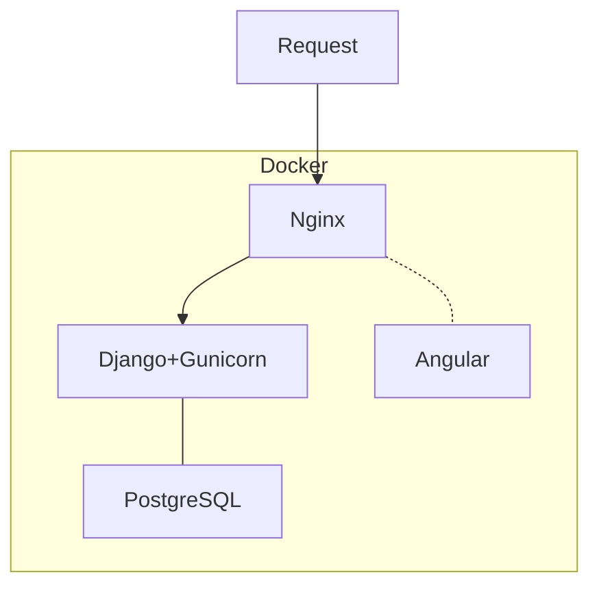
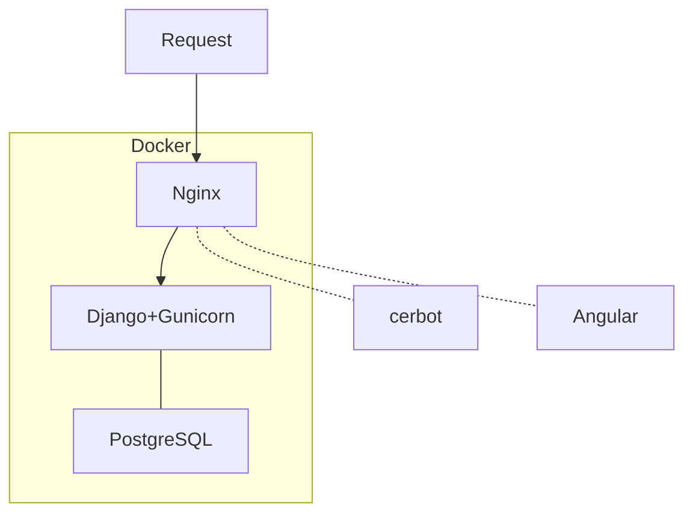

# First time configuration

**NOTICE: If you are doing this on your own machine, please start from [Database migration](#database-migration)**

## VM Clean up

```bash
# For srpms.cecs.anu.edu.au only
# Since we are using docker, we'll disable un-necessary services
sudo systemctl disable nginx.service
sudo systemctl stop nginx.service
sudo systemctl disable postgresql.service
sudo systemctl stop postgresql.service
sudo pkill -U tomcat8
```

TODO: The VM currently has too many unrelated packages installed, need to further clean up the environment.

## Install docker

```bash
sudo apt-get update

# Install packages to allow apt to use a repository over HTTPS
sudo apt-get install \
    apt-transport-https \
    ca-certificates \
    curl \
    gnupg2 \
    software-properties-common

# Add Docker’s official GPG key
curl -fsSL https://download.docker.com/linux/debian/gpg | sudo apt-key add -


# Setup the stable repository
sudo add-apt-repository \
   "deb [arch=amd64] https://download.docker.com/linux/debian \
   $(lsb_release -cs) \
   stable"

# Update apt and install docker
sudo apt-get update
sudo apt-get install docker-ce docker-ce-cli containerd.io
```

## Configure iptable

```bash
sudo apt-get install iptables-persistent

# Put the iptables rule under corresponding folder
#mv iptable-rules /etc/iptables/rules.v4

# Let docker reload its iptables rules
sudo systemctl restart docker.service

# Reload the configuration
sudo systemctl restart netfilter-persistent
```

## Configure repository for group access

```bash
# Create folder at root for group access
sudo mkdir /srpms
sudo addgroup srpms
sudo chown root:srpms /srpms
sudo chmod g+w /srpms

# Download source code
git clone https://gitlab.cecs.anu.edu.au/u6513788/comp8755-srpms.git .
# Configure git for group access
git config core.sharedRepository group
# Change file ownership and permission to allow group access
chgrp -R srpms .
chmod -R g+w .
# Git pack files should be immutable
chmod g-w objects/pack/*
# Configure new file to inherit directory's group id
find -type d -exec chmod g+s {} +
```

## Secrets

```bash
# Create directory for storing secrets, and give group access
sudo mkdir /srpms-secrets
sudo chown root:srpms /srpms-secrets
sudo chmod 750 /srpms-secrets
sudo chmod g+s /srpms-secrets

# Create secrets
# NOTE: DO NOT USE "echo" AS IT WOULD SUFFIX NEW LINE
sudo printf '<secret content>' > /srpms-secrets/postgres-db.txt
sudo printf '<secret content>' > /srpms-secrets/postgres-user.txt
sudo printf '<secret content>' > /srpms-secrets/postgres-passwd.txt

# "--" would prevent "--" raise error when its at the start of the content string
sudo printf -- '<secret content>' > /srpms-secrets/postgres-init-args.txt

sudo printf '<secret content>' > /srpms-secrets/django_secret_key.txt
```

**NOTE: secrets still works even if inside a container with socket passing, and does not require any special configuration**

## CI/CD Setup

We'll GitLab's shell executor with docker runner for this purpose, for reason why we don't use docker executor, refer to the [CI/CD](#ci/cd) section.

```bash
# cd to the runner image dir
cd gitlab-ci

# Register first
docker-compose run runner register

# Start the runner
docker-compose up -d
```

## Database migration

**WARNING: Please make sure there is no database under the same name before operate**

- If you already have a database dump name `<db_dump>`, you can import it to the database container by
  1. Copy to the database container
     `docker cp <db_dump> srpms_db-postgres:/`
  2. Import to the database
     `docker-compose -f <compose file> run db-postgres psql -U <db_name> < /<db_dump>`
- If you wants to initialize a new database
  `docker-compose -f <compose file> run django-gunicorn python manage.py migrate`

# Deploy - Development



Summary of development environment:

- <u>Nginx container</u>: use as a reverse proxy to redirect request, also serve front-end code
- <u>Angular container</u>: running `ng build --watch` to produce front-end code, only communicate with nginx through shared volume
- <u>Django+Gunicorn container</u>: running `gunicorn --reload --bind :8000` to serve back-end content (including back-end static files)
- Both the angular and django container would auto detect change of file to auto-reload content, thus convenient for development

**Please make sure you are under the project directory when using following commands**

```bash
# Start, append -d if you want to run in background
docker-compose -f docker-compose.dev.yml up

# To apply changes of Dockerfile and compose file to running containers, use
docker-compose -f docker-compose.dev.yml up -d --build

# Stop services
docker-compose -f docker-compose.dev.yml stop

# Only issue when you know what you are doing
# This command will remove container, network, and volumes, which means the database would be removed as well
docker-compose -f docker-compose.dev.yml down
```

- The about command would
  - Listen at `localhost:8000` for HTTP
  - Listen at `localhost:8001` for HTTPS
  - `/media/`, `/static/`, `/api/` would be directed to Django container
  - All other requests would request file in nginx, including front-end code
- To attach to a running container, use `docker exec -it <service_name> <command>`
  - For example, to attach to the Django container for debugging, use command
    `docker exec -it django-gunicorn_1 /bin/sh`
- To run a single container with some command, use `docker-compose -f <compose file> run <service_name> <command>`
  - Using this command has the advantage over regular `docker run`, as it will apply settings specified in the docker-compose file

## Access ANU LDAP outside campus

- For Mac:

  - `sudo 389:ldap.anu.edu.au:389 <UniID>@srpms.cecs.anu.edu.au`

- For Linux:

  - ```bash
    # Obtain srpms network name by `docker network ls`, normally it should be 'srpms_srpms_network'
    DOCKER_GATEWAY="$(docker network inspect bridge --format='{{(index .IPAM.Config 0).Gateway}}')"
    sudo ssh -L "$DOCKER_GATEWAY":389:ldap.anu.edu.au:389 <UniID>@srpms.cecs.anu.edu.au
    ```

  - You also need to make sure your iptables allow incoming traffic from the srpms network subnet, otherwise connections from the container would be blocked and won't reach the ssh tunnel.
    
    ```bash
    sudo iptables -A INPUT -d $(docker network inspect bridge --format='{{(index .IPAM.Config 0).Subnet}}') -p tcp -m tcp --dport 389 -j ACCEPT
    ```
    
    

# Deploy - Production



Summary of production environment:

- <u>Nginx container</u> will serve compiled front-end code and back-end static resources, while request of dynamic resources would be re-directed to Django
- <u>Django+Gunicorn container</u> will handle any dynamic request (query, etc.)
- <u>Certbot container</u> will be used for obtain and update SSL certificate from Let's Encrypt, it'll also try to renew the certificate every 12 hours, and singal
- <u>Angular-client</u>
  - Exists for the sole purpose of copying compiled front-end to a volume share between Nginx and itself
  - Exit after finish copy
  - Does not have any network connection

```bash
# Start up
docker-compose -f docker-compose.prod.yml up -d

# Stop
docker-compose -f docker-compose.prod.yml stop

# Check logs, append '-f' for following
docker-compose -f docker-compose.prod.yml logs

# Shutdown and remove containers
docker-compose -f docker-compose.prod.yml down
```

## Behavior

### SSL initial setup

The deployment would perform the following action on first-time-run:

- Nginx create a dummy certificate for localhost, expire after 1 day. Otherwise nginx would fail to launch if it cannot find the ssl certificate
- Certbot launch, if certificate does not exist, sleep for 10s to wait for nginx
- Certbot check if the certificates are dummry (i.e. CN is localhost), if yes, remove certificates, then obtain certificate from letsencrypt, and tell nginx to reload itself
  - Note that if some replica of nginx start after this, they might fail
  - In order to reload nginx, source code is mapped inside certbot container, as well as the docker socket. As such certbot is not part of the srpms_network, and can only communicate to nginx through their share volume (i.e. the challenge file directory and letsencrypt certificate directory).
  - For preventing unwanted behavior on docker socket passing, the certbot container is configured to use host network

## Caveats

### Disable the REST browsable API on production

Simple add the following to the `settings.py`
```python
REST_FRAMEWORK = {
    'DEFAULT_RENDERER_CLASSES': (
        'rest_framework.renderers.JSONRenderer',
    )
}
```

[Refer to here](http://masnun.com/2016/04/20/django-rest-framework-remember-to-disable-web-browsable-api-in-production.html) for the reason of doing so.

# CI/CD

- Since deploying a Kubernete for this project is a bit over kill for the current phase, we only use `.gitlab-ci.yml` for CI/CD, and manually set the DevOps job inside in.
- In fact, GitLab's Auto DevOps also just another `.gitlab-ci.yml`, but with pre-defined content inside, [see here for more details](https://docs.gitlab.com/ee/topics/autodevops/#using-components-of-auto-devops)
- Also, we are using docker.sock-in-docker for running the CI pipeline, [this article](https://jpetazzo.github.io/2015/09/03/do-not-use-docker-in-docker-for-ci/) explains fairly well why we should use this approach instead of docker-in-docker
  - **However, when running compose inside the CI container, we effitivetly mount files in CI container to other container, hopefully this wouldn't cause any problem**
- Reasons why we don't use docker executor:
  - Because you basically need to repeat you compose file agile in the runner configuration, and it's very bad for maintenance.
  - Our custom built runner image already contain docker and docker-compose, thus we don't need use docker executor to burden ourselves

```bash
# Make sure you run the following in before_script for test jobs, otherwise it would have a hard time finding ldap server
export LDAP_ADDR="ldap://$(docker network inspect bridge --format='{{(index .IPAM.Config 0).Gateway}}')"
```

# Reference 

[How To Get Angular and Nginx Working Together Properly for Development](https://medium.com/better-programming/how-to-properly-get-angular-and-nginx-working-together-for-development-3e5d158734bf)

## Docker

- Environment Variable priorities when using compose
  1. Compose file
  2. Shell environment variables
  3. Environment file
  4. Dockerfile
  5. Variable is not defined

[Building Django Docker Image with Alpine](https://medium.com/c0d1um/building-django-docker-image-with-alpine-32de65d2706)

[Docker Compose with NginX, Django, Gunicorn and multiple Postgres databases](
https://pawamoy.github.io/2018/02/01/docker-compose-django-postgres-nginx.html
)

[Understanding Docker Networking Drivers and their use cases](https://blog.docker.com/2016/12/understanding-docker-networking-drivers-use-cases/)

[Deploying Gunicorn](http://docs.gunicorn.org/en/latest/deploy.html)

[Deploying nginx + django + python 3](https://tutos.readthedocs.io/en/latest/source/ndg.html)

[Why Your Dockerized Application Isn’t Receiving Signals](https://hynek.me/articles/docker-signals/)

[Trapping Signals in Docker Containers](https://blog.codeship.com/trapping-signals-in-docker-containers/)

[Using docker-compose with CI - how to deal with exit codes and daemonized linked containers?](https://stackoverflow.com/questions/29568352/using-docker-compose-with-ci-how-to-deal-with-exit-codes-and-daemonized-linked)

## SSL certificates

To generate a self-signed SSL certificate for `localhost` (for development purpose)

```
openssl req -x509 -out localhost.crt -keyout localhost.key \
  -newkey rsa:2048 -nodes -sha256 \
  -subj '/CN=localhost' -extensions EXT -config <( \
   printf "[dn]\nCN=localhost\n[req]\ndistinguished_name = dn\n[EXT]\nsubjectAltName=DNS:localhost\nkeyUsage=digitalSignature\nextendedKeyUsage=serverAuth")
```

This self-sign certificate would not accept by chrome, as such, you need to go to `chrome://flags/#allow-insecure-localhost`, and set it to `enable`

[How to Setup a SSL Certificate on Nginx for a Django Application](https://simpleisbetterthancomplex.com/tutorial/2016/05/11/how-to-setup-ssl-certificate-on-nginx-for-django-application.html)

[Nginx and Let’s Encrypt with Docker in Less Than 5 Minutes](https://medium.com/@pentacent/nginx-and-lets-encrypt-with-docker-in-less-than-5-minutes-b4b8a60d3a71)

[Certificates for localhost](https://letsencrypt.org/docs/certificates-for-localhost/)

## CI/CD

[Getting started with GitLab CI/CD](https://docs.gitlab.com/ee/ci/quick_start/)

[Run GitLab Runner in a container](https://docs.gitlab.com/runner/install/docker.html)

[Register Runners](https://docs.gitlab.com/runner/register/index.html#docker)

[Using components of Auto-DevOps](https://docs.gitlab.com/ee/topics/autodevops/#using-components-of-auto-devops)

## Server iptables rule

```
# Title: iptables rules for SRPMS Server
# Author: Dajie Yang
# Last Modify: Aug 23 2019

################
# Mangle Table #
################
# *mangle

################
# Filter Table #
################
*filter
:INPUT DROP [0:0]
:FORWARD DROP [0:0]
:OUTPUT ACCEPT [0:0]
:addrtype-general - [0:0]
:anti-scan - [0:0]
:app-limit - [0:0]
:app-reject - [0:0]
# Allow all loopback traffic
-A INPUT -i lo -j ACCEPT
-A OUTPUT -o lo -j ACCEPT
# Quickly process packets for which we already have a connection
-A INPUT -m conntrack --ctstate RELATED,ESTABLISHED -j ACCEPT
-A OUTPUT -m conntrack --ctstate RELATED,ESTABLISHED -j ACCEPT
-A FORWARD -m conntrack --ctstate RELATED,ESTABLISHED -j ACCEPT
# Drop INVALID packets
-A INPUT -m conntrack --ctstate INVALID -m limit --limit 3/min --limit-burst 10 -j LOG --log-prefix "[INVALID] "
-A INPUT -m conntrack --ctstate INVALID -j DROP
# Ok icmp codes for INPUT
-A INPUT -p icmp --icmp-type destination-unreachable -j ACCEPT
-A INPUT -p icmp --icmp-type source-quench -j ACCEPT
-A INPUT -p icmp --icmp-type time-exceeded -j ACCEPT
-A INPUT -p icmp --icmp-type parameter-problem -j ACCEPT
-A INPUT -p icmp --icmp-type echo-request -j ACCEPT
# Ok icmp code for FORWARD
-A FORWARD -p icmp --icmp-type destination-unreachable -j ACCEPT
-A FORWARD -p icmp --icmp-type source-quench -j ACCEPT
-A FORWARD -p icmp --icmp-type time-exceeded -j ACCEPT
-A FORWARD -p icmp --icmp-type parameter-problem -j ACCEPT
-A FORWARD -p icmp --icmp-type echo-request -j ACCEPT
-A FORWARD -p icmp --icmp-type echo-reply -j ACCEPT
# Allow DHCP client to work
-A INPUT -p udp --sport 67 --dport 68 -j ACCEPT
# Procss special address, generally
-A INPUT -j addrtype-general
-A addrtype-general -m addrtype --dst-type LOCAL -j RETURN
-A addrtype-general -m addrtype --dst-type MULTICAST -j RETURN
-A addrtype-general -m addrtype --dst-type BROADCAST -j RETURN
-A addrtype-general -m addrtype --dst-type UNICAST -j DROP
-A addrtype-general -m limit --limit 3/min --limit-burst 10 -j LOG --log-prefix "[SPECIAL ADDR] "
-A addrtype-general -j DROP
# allow MULTICAST mDNS for service discovery
-A INPUT -p udp -d 224.0.0.251 --dport 5353 -j ACCEPT
# allow MULTICAST UPnP for service discovery
-A INPUT -p udp -d 239.255.255.250 --dport 1900 -j ACCEPT
# Blocking port scan
-A INPUT -p tcp --tcp-flags ACK,FIN FIN -j anti-scan
-A INPUT -p tcp --tcp-flags ACK,PSH PSH -j anti-scan
-A INPUT -p tcp --tcp-flags ACK,URG URG -j anti-scan
-A INPUT -p tcp --tcp-flags ALL ALL -j anti-scan
-A INPUT -p tcp --tcp-flags ALL NONE -j anti-scan
-A INPUT -p tcp --tcp-flags ALL SYN,RST,ACK,FIN,URG -j anti-scan
-A INPUT -p tcp --tcp-flags SYN,FIN SYN,FIN -j anti-scan
-A INPUT -p tcp --tcp-flags FIN,RST FIN,RST -j anti-scan
-A INPUT -p tcp --tcp-flags ALL SYN,FIN -j anti-scan
-A INPUT -p tcp --tcp-flags ALL URG,PSH,FIN -j anti-scan
-A INPUT -p tcp --tcp-flags ALL FIN -j anti-scan
-A INPUT -p tcp --tcp-flags ALL URG,PSH,SYN,FIN -j anti-scan
-A INPUT -p tcp --tcp-flags SYN,RST SYN,RST -j anti-scan
-A anti-scan -m limit --limit 3/min --limit-burst 3 -j LOG --log-prefix "[PORT SCAN] "
-A anti-scan -m recent --set --name PORT-SCAN --mask 255.255.255.255 --rsource
-A anti-scan -m recent --update --seconds 30 --hitcount 10 --name PORT-SCAN --mask 255.255.255.255 --rsource -j DROP
# Exception for applications
# SSH
-A INPUT -p tcp -m tcp --dport 22 -j LOG --log-prefix "[SSH] "
-A INPUT -p tcp -m tcp --dport 22 -j app-limit
# HTTP/HTTPS, does not currently apply any connection limit
-A INPUT -p tcp -m tcp --dport 80 -j ACCEPT
-A INPUT -p udp -m udp --dport 80 -j ACCEPT
-A INPUT -p tcp -m tcp --dport 443 -j ACCEPT
-A INPUT -p udp -m udp --dport 443 -j ACCEPT
# Limit connection frequency to 10 hits per 30s, after that block the client for 5 minutes
-A app-limit -m conntrack --ctstate NEW -m recent --set --name APP-LIMIT --mask 255.255.255.255 --rsource
-A app-limit -m conntrack --ctstate NEW -m recent --update --seconds 30 --hitcount 10 --name APP-LIMIT --mask 255.255.255.255 --rsource -j app-reject
-A app-limit -j ACCEPT
-A app-reject -m limit --limit 5/min -j LOG --log-prefix "[APP REJECT] "
-A app-reject -j REJECT --reject-with icmp-port-unreachable
COMMIT
# Done
```

## Misc.

[Keep exit codes when trapping SIGINT and similar?](https://unix.stackexchange.com/questions/235582/keep-exit-codes-when-trapping-sigint-and-similar)

[Trapping Signals in Docker Containers](https://blog.codeship.com/trapping-signals-in-docker-containers/)

[How to configure an existing git repo to be shared by a UNIX group](https://stackoverflow.com/questions/3242282/how-to-configure-an-existing-git-repo-to-be-shared-by-a-unix-group)

[How do I parse command line arguments in Bash?](https://stackoverflow.com/questions/192249/how-do-i-parse-command-line-arguments-in-bash)

[When do we need curly braces around shell variables?](https://stackoverflow.com/questions/8748831/when-do-we-need-curly-braces-around-shell-variables)

