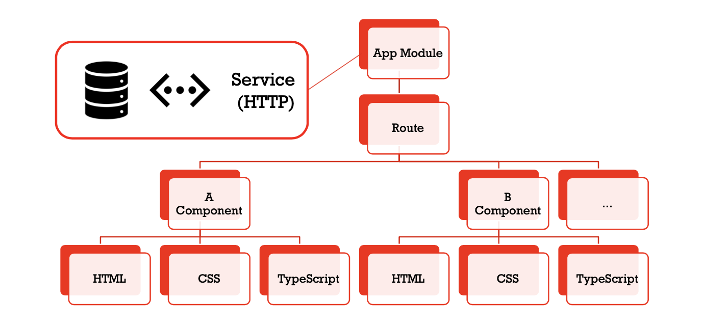

# File Structure
```
srpms-client/
├── e2e/                                # Angular end-to-end tests relevant files
├── src/
│   ├── app/
│   │   ├── contract                    # Contract
│   │   ├── contract-dialog             # Contract Dialog
│   │   ├── contract-form               # Contract form
│   │   ├── contract-form-element       # Contract form element
│   │   ├── contract-mgt                # Contract MGT
│   │   ├── contract-mgt-dialog         # Contract MGT dialog
│   │   ├── contract-viewer             # Contract edit page for the contract owner
│   │   ├── error-dialog                # Error dialog
│   │   ├── header                      # Top bar of the application
│   │   ├── home                        # Index page
│   │   ├── login-dialog                # Login dialog
│   │   ├── sidenav                     # Side bar of the application
│   │   ├── accounts.service.spec.ts    # Accounts service testing
│   │   ├── accounts.service.ts         # Accounts service
│   │   ├── api-url.ts                  # API URL
│   │   ├── app-routing.module.ts       # Routes of components
│   │   ├── app.component.html          # Main application component
│   │   ├── app.component.scss          # Main application stylesheet
│   │   ├── app.component.spec.ts       # Main application testing
│   │   ├── app.component.ts            # Main application code
│   │   ├── app.module.ts               # Angular main module declarations 
│   │   ├── auth.interceptor.service.spec.ts    # Login component HTTP interception service testing
│   │   ├── auth.interceptor.service.ts         # Login component HTTP interception service
│   │   ├── contract-form-control.service.ts    # Contract form control service
│   │   ├── contract-mgt.service.spec.ts        # Contract MGT service testing
│   │   ├── contract-mgt.service.ts     # Contract MGT service
│   │   ├── contract-service.spec.ts    # Contract service testing
│   │   ├── contract-service.ts         # Contract service
│   │   ├── element-base.ts             # Element source code
│   │   ├── element-datepicker.ts       # Element type datepicker declaration
│   │   ├── element-dropdown.ts         # Element type dropdown declaration
│   │   ├── element-radiobox.ts         # Element type radiobox declaration
│   │   ├── element-textarea.ts         # Element type textarea declaration
│   │   ├── element-textbox.ts          # Element type textbox declaration
│   │   ├── element-user.ts             # Element type autocomplete declation
│   │   ├── element.service.ts          # Element service
│   │   └── research_mgt-objects.ts     # The back-end data object formation
│   ├── assets/             # Git relevant files   
│   ├── environments/       # Production mode setting files
│   ├── favicon.ico         # Angular logo
│   ├── index.html          # Main index html file
│   ├── main.ts             # Production mode enable setting
│   ├── polyfills.ts        # Angular prefix setting
│   ├── srpms-theme.scss    # General theme of the UI
│   ├── styles.scss         # Global stylesheet
│   └── test.ts             # Testing
├── Dockerfile      # Dockerfile for building the angular image
└── start.sh        # Start up script (only for docker use)
```

# Front-end overview
The front-end built on the Angular Framework consists of a set of components. The main application module has
a responsibility to set the URL route of all components and to declare all components and modules the system is
using upon its initialisation. Each component has its own template(HTML), styling(CSS) and code(Typescript).
If the component has the functionality to communicate with the back-end, these communication methods are defined in
the service. This service can be re-used in any component and is categorised into several service files based on its
functionality.


