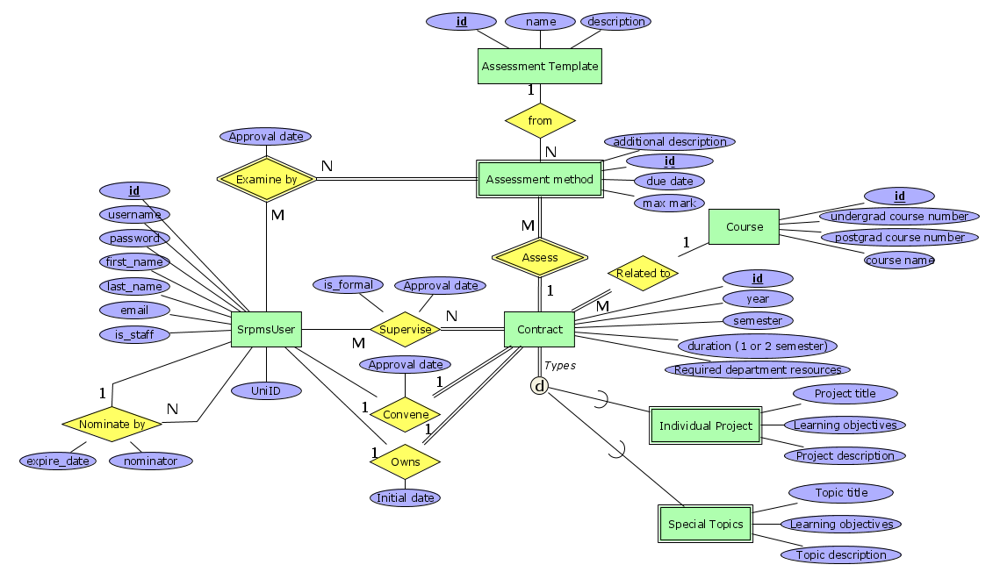

# Relational Model

This file exist solely for simple reference, it does not include data types and constraints, please read documentations in code for more details.



## Accounts

Refer to `srpms/accounts/models.py` for details, especially the reason why we need `AssessmentExamine` relation.

### SrpmsUser

```
SrpmsUser(id, username, password, first_name, last_name, email, uni_id, is_staff, nominator, expire_date)
```

## Research_mgt

Refer to `srpms/research_mgt/models.py` for details

### Course

```
Course(id, course_number, name, units)
unique: [course_number]
PK: {id}
```

### Contract

```
Contract(id, year, semester, duration, resources, course, convener, convener_approval_date, owner, create_date, submit_date, was_submitted)
PK: {id}
FK: [convener] -> SrpmsUser, [owner] -> SrpmsUser, [course] -> Course
```
### Individual Project
```
IndividualProject(contract, title, objectives, description)
PK: {contract}
FK: [contract] -> Contract
```

### Special Topic

```
SpecialTopics(contract, title, objectives, description)
PK: {contract}
FK: [contract] -> Contract
```

### Supervise

```
Supervise(supervisor, contract, is_formal, supervisor_approval_date)
unique: [supervisor, contract]
FK: [supervisor] -> SrpmsUser, [contract] -> Contract
```

### Assessment Template

```
AssessmentTemplate(id, name, description, max_weight, min_weight, default_weight)
unique: [name]
PK: {id}
```

### Assessment

```
Assessment(id, template, contract, additional_description, due, weight)
PK: {id}
FK: [template] -> AssessmentTemplate, [contract] -> Contract
```
### Examine

```
Examine(id, contract, examiner, nominator)
PK: {id}
unique: [contract, examiner]
FK: [contract] -> Contract, [examiner] -> SrpmsUser, [nominator] -> SrpmsUser
```

### Assessment Examine

```
AssessmentExamine(id, contract, assessment, examine, examiner_approval_date)
PK: {id}
unique: [assessment, examine]
FK: [contract] -> Contract, [examine] -> Examine
```

